# FIFA-21-DATA-CLEANING-DOCUMENTATION

---

## Background/Introduction
This is a breakdown of the **FIFA 2021 dataset data cleaning process**. 
The dataset was provided by Promise Nonso on Twitter, as a data cleaning challenge for data analysts either a newbie or intermediate data analyst with the choice of using any data tools.
The tool used for this data challenge was **_Microsoft Power Query Editor_** available in either Microsoft Excel or Microsoft Power Bi.

## Data Description
The raw FIFA 21 dataset was sourced from Kaggle, it contains **18,979** rows and **77** columns. It includes range of information about football players and their performance up till 2021.

## Data Cleaning Objective
Data Cleaning is the process of fixing or removing incorrect, corrupted, incorrectly formatted, duplicate, or incomplete data within a dataset. The objective of this project is to perform data cleaning thereby improving the quality of the dataset.

## Data Transformation
I used the **_Microsoft Power Bi tool_** for this project, the raw/messy dataset was loaded into the power query and the following transformation was performed on the dataset.

## Special Characters
After importing the originally downloaded data into the power query editor, I noticed some strings and  special characters, this was removed by changing the file origin to **UTF-8 encoding**, it automatically replace the strings and  special character to the appropriate letters.

**Special Characters Before**                      |         **Special Characters After**
:-------------------------------------------------:|:--------------------------------------------------------------:
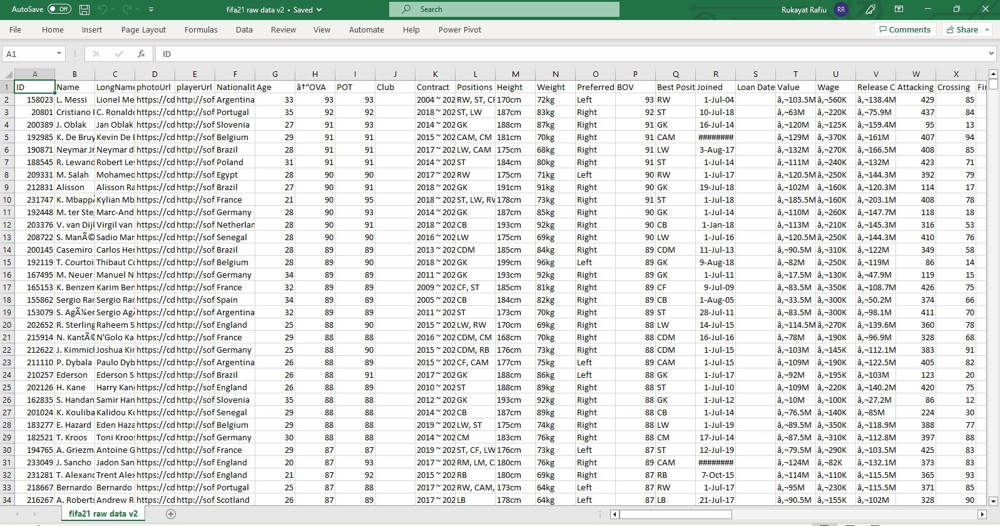                               | 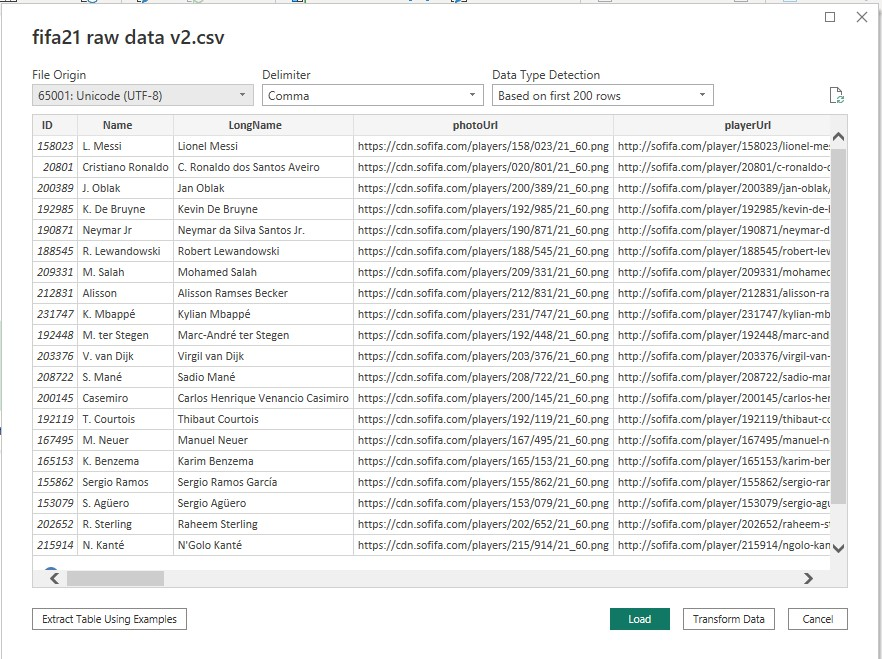

## Photo url and Player url
Both columns are not needed because they are metadata i.e, a data providing information about other data, in this case, it gives information about each player which is already included in the dataset. The two columns were deleted so as to avoid repetition of information.

## Short Name
Using the filter button, I realized one of the names contain a special character, this special character was replaced with the appropriate letter (S).

**Short Name Before**                                 |          **Short Name After**
:----------------------------------------------:|:-------------------------------------------------:
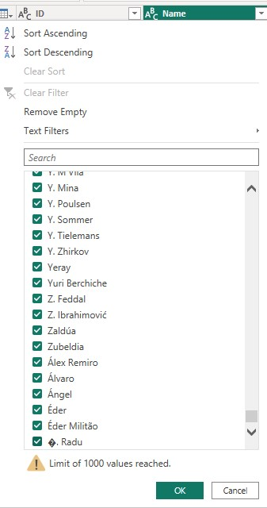                      |                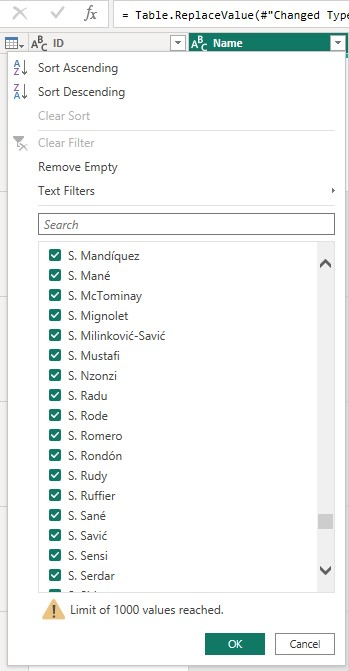

## OVA and POT
The **_Overall rating_** (OVA) and **_potential rating_** (POT) are to be measured in percentage(%), this was achieved by dividing both the OVA and POT column by 100 and then changed the data type to percentage (%).

**OVA and POT Before**                               |           **OVA and POT After**  
:---------------------------------------------------:|:------------------------------------------------------------:
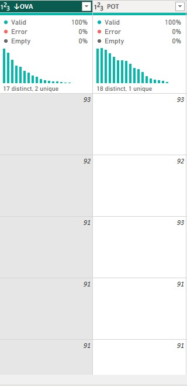                                 |          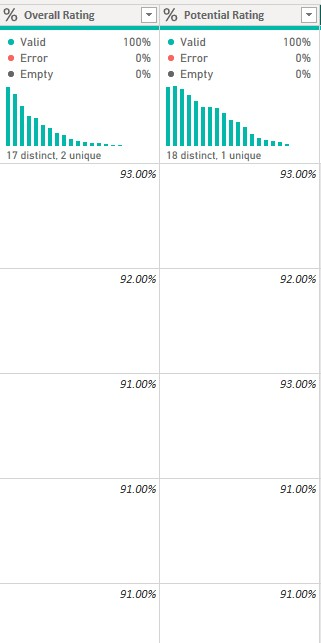

## Club
The Club column contained some extra spaces between them that needs cleaning. To clean this, I selected the club column, then right click, select the transform option from the list, then select Trim, this automatically remove all white spaces from the column.

**Club Before**                               |           **Club After**  
:---------------------------------------------------:|:------------------------------------------------------------:
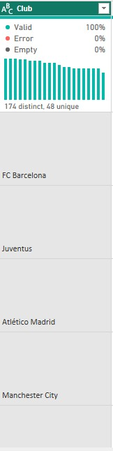                                 |          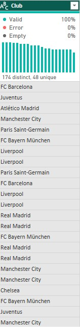

## Contract
The contract column consist of different data formats and data types as seen in the image below. After careful observation, the following columns was extracted from the contract column.

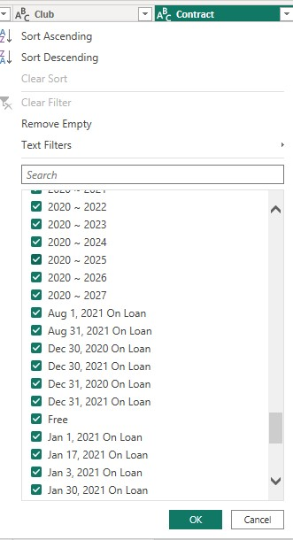

- ### Contract Agreement
This column indicates the type of agreement signed for each player which can either be **_Contract, Free or on Loan_**. A conditional column with the following conditional statements was introduced.

**_If Contract contains Loan output Loan_**

**_Else If Contract equals Free output Free_**

**_Else Contract_**

- ### Contract Start and Contract End
This was done by splitting the contract column by the delimiter (~) found in the column, thereby creating two different columns. The two columns was then renamed as Contract Start and Contract End respectively, the contract start column contains some errors which was corrected using the remove errors option, the contract end column contains some empty cells, this was corrected by replacing the empty cells with null. These errors occur because some players do not have a contract, hence no start and end date.

- ### Contract Duration
This column shows the period through which a player contract is effective. This was done by using the custom column to calculate the duration as shown in the formula below

**_Contract Duration = Contract End – Contract Start_**

**Contract Before**                               |           **Contract After**  
:---------------------------------------------------:|:------------------------------------------------------------:
                                 |          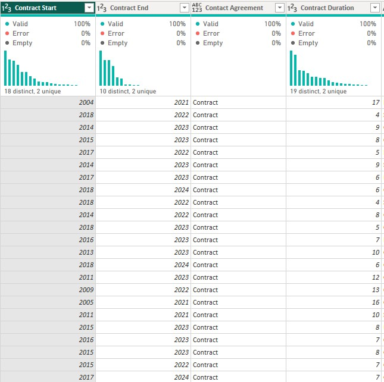

## Height
This column represent the height of each players, some entries were measured in cm while others are in feet and inches. To maintain a consistent unit (cm), the following steps were taken.

- ###	To convert foot to inches (Multiply by 12)
This was achieved by creating a column that multiplies all values in foot (i.e. 5 and 6) by 12, thereby converting the values to inches.

-	### Convert Inches to cm 
I created a conditional column (convert to cm) with the following conditional statement.

**_If height ends with cm output 1_**

**_Else 0.393701_**

-	### Splitting the Height column by Delimiter (‘)
This was done to separate the feet from inches, after splitting, two different columns were created named; **_Height 1 and Height 2_**. the values in Height 1 includes(cm) and (“), these were removed, then multiply by the column **“multiply by 12”**, this new column is names **Multiplication**.

The values in Height 2 contained some null values, this was replaced with zero, after which a new column was created by adding “**Height 2**” and “**Multiplication**” columns, the resulting column is named **Addition**.

-	### Height in cm
A new column was added using the custom column formula, **_Height(cm) = [Addition] / [convert to cm]_**. 

This step provides me with the final value of Height in cm. All other 5 columns created earlier was deleted so as to keep the data clean, leaving only Height(cm).

**Height Before**                               |           **Height After**  
:---------------------------------------------------:|:------------------------------------------------------------:
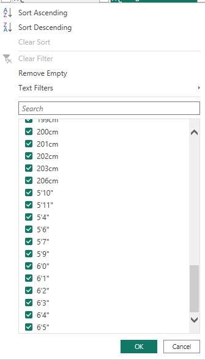                                 |          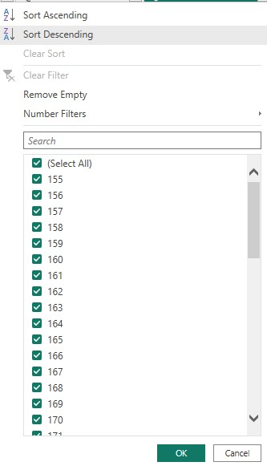

## Weight (lbs)
This column represent the weight of each players, some of the records were measured in kg while others in lbs. To maintain a consistent unit of measurement(lbs), I used the following M code to carry out the transformation.

**_if Text.Contains([Weight],"kg") then Number.From(Text.BeforeDelimiter ([Weight], "kg")) * 2.205 else Text.BeforeDelimiter([Weight],"lbs"))_**

**Weight Before**                               |           **Weight After**  
:---------------------------------------------------:|:------------------------------------------------------------:
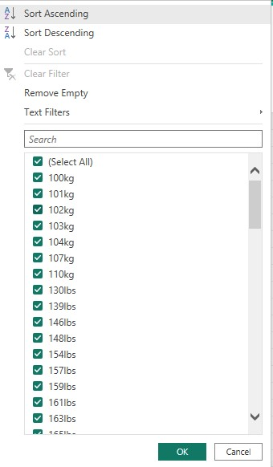                                 |          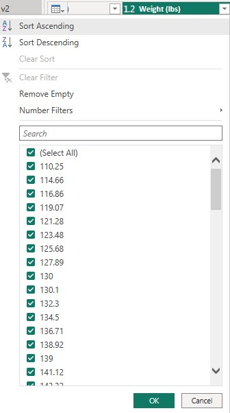

## BOV
The **_best overall_** (BOV) is to be measured in percentage (%), this was achieved by dividing the BOV column by 100 and then changed the data type to percentage (%).

**BOV Before**                               |           **BOV After**  
:---------------------------------------------------:|:------------------------------------------------------------:
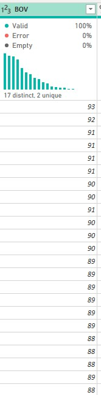                                 |          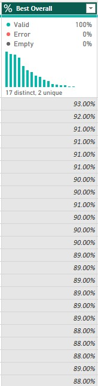

## Value, Wage and Release Clauses
These columns represent the market value, weekly wage and release clause of each players, the date in each columns contained the (€) sign, the suffix (M) and (K) which represent the euros, million and thousand respectively. I used the following M code to remove the € from the three columns and to convert the numbers to dollars.

**Value**
---

**_(if Text.Contains([Value], "M") then Number.From(Text.BeforeDelimiter ([Value], "M")) * 1000000 else Number.From(Text.BeforeDelimiter ([Value], "K")) * 1000) * 1.08)_**

**Wage**
---

**_(if Text.Contains([Wage], "K") then Number.From(Text.BeforeDelimiter ([Wage], "K")) * 1000 else Number.From([Wage])) * 1.08)_**

**Release Clause**
---

**_(if Text.Contains([Release Clause], "M") then Number.From(Text.BeforeDelimiter ([Release Clause], "M")) * 1000000 else Number.From(Text.BeforeDelimiter ([Release Clause], "K")) * 1000) * 1.08)_**

**Value**                         |         **Wage and Releause Clause Before**           |      **Value, Wage and Release Clause After**  
:--------------------------------:|:-----------------------------------------------------:|:-------------------------------------------------:
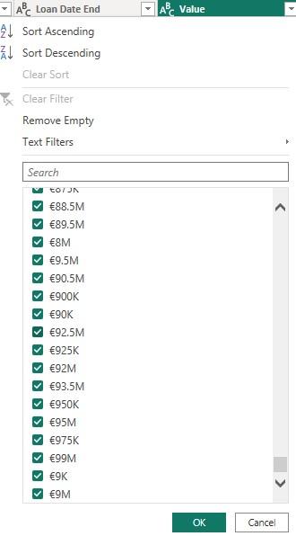             |          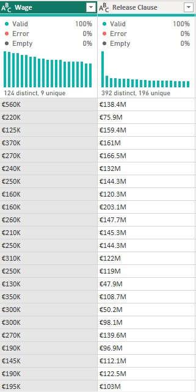      |       

## W/F, SM, and IR 
These columns contained the (★) symbol, this represents the star ratings, the ★ symbol was removed  and changed to a whole number data type.

**W/F and SM Before**           |    **IR Before**              |           **W/F and SM After**        |       **IR After**  
:-----------------------:|------------------------------:|:-------------------------------:|:----------------------------:
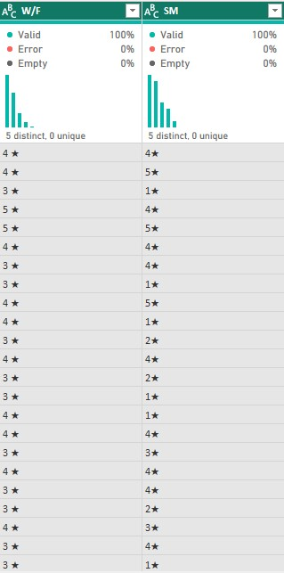   |    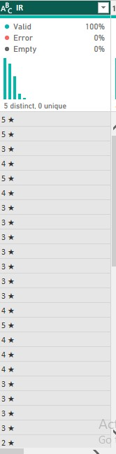         |            |        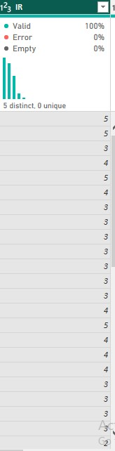

## Hits
This column contained some values in (K) which represents thousand, to remove this, I used the following M code and later changed the data type to whole number.

**_if Text.Contains([Hits], "K") then Number.From(Text.BeforeDelimiter([Hits], "K")) * 1000 else Number.From([Hits]))_** 

**Hits Before**                               |           **Hits After**  
:---------------------------------------------------:|:------------------------------------------------------------:
                                 |          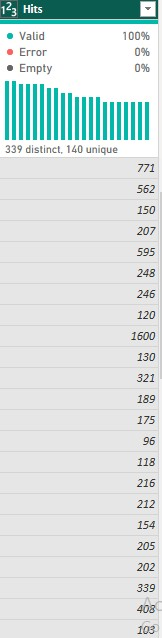

## Conclusion
The data cleaning seems unachievable at first glance but eventually became interesting, the whole process made me realized the importance of cleaning data. This challenge has helped me improve my data cleaning skills and at the same time, learnt a lot during the process. 
The cleaned dataset is now ready for further analysis and visualization.

This is my first data project documentation, I will appreciate your feedback and recommendations.

Thank you.
